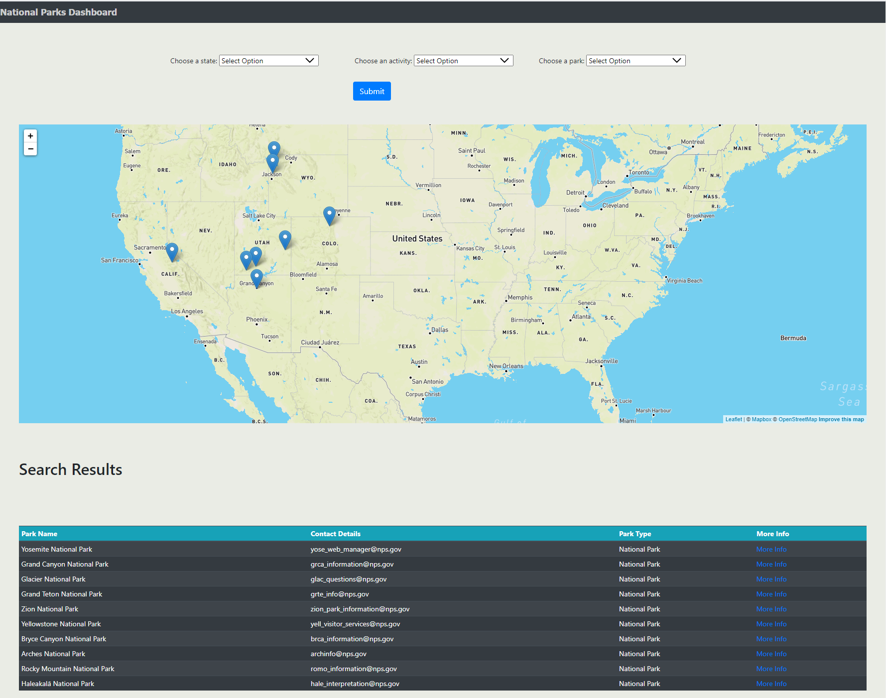

# US NATIONAL PARKS

Welcome to US National Parks interactive site. If you need a push to decided which park to visit, you are in the right place!

1. What is the purpose of this dashboard?

To present useful information, where any person can search key details about US Parks, leveraging our powerful filters, based on various parameters such as activities, states, park names; as well as demographic data visualization that will help potential visitors to take the best decision.

2. How this Dashboard is made of?

This a "FullStack" application based on three main layers:

- Database : Mongo Atlas
- Flask Python
- Front End

3. The data is stored in Mongo DB in JSON format. Following DB collections were created in the database.

    - parks ==> Stores park related data like contact address, operating hours
    - Activities ==> Stores activities that can be performed in national parks
    - ThingsToDo ==> Stores detailed information about guided tours
    - campgrounds ==> Stores campsites information for each park
    - webcams ==> Stores live picture by webcam
    - monthly_visits_2019 ==> This DB collection is created from a csv file
    - last_decade_visits  ==> This DB collection is created from a csv file
MONGO DB is deployed in Atlas cloud server. The cloud server is aws located in virginia
## Flask

4. Various flask routes created that helps fetching data at various data points within application.
  - 
      - Search parks by state ==> /parks/v1.0/SearchParksByState/<state>
      - Search parks by activity ==> /parks/v1.0/SearchParksByActivity/<activity>
      - Search parks by park name ==> /parks/v1.0/SearchParksByParkName/<parkname>
      - Search parks by state and activity ==> /parks/v1.0/SearchParksByStAndAct/<state>/<activity>
      - Search parks by state and parkname ==> /parks/v1.0/SearchParksByStAndPark/<state>/<parkname>
      - Search parks by activity and park name ==> /parks/v1.0/SearchParksByActAndPark/<activity>/<parkname>
      - Search parks by state and parkname ==> /parks/v1.0/SearchParksByActStateAndPark/<activity>/<state>/<parkname>
      - Retrieve all unique park names ==> /parksNames
      - Retrieve all states ==> /states
      - Retrieve all activities ==> /activities
      - Render Park Details Page using park code value ==> /parks/v1.0/ParkDetails/<parkcode>
      - Search parks by park code ==> /parks/v1.0/ParkDetailsbyParkCode/<parkcode>
      - Search park visits by park names ==> /parks/v1.0/AvailableVisitsParknames/
      - Render park analysis dashboard  ==> /parks/v1.0/ParkAnalysis/
      - Search parks by region ==> /parks/v1.0/ParksCodesByRegion/<region>
      - Search all unique regions ==> /parks/v1.0/AllRegions/
      - Search 2019 vists of all parks by region selected ==> /parks/v1.0/Visits2019ByRegion/<region_name>
      - Search monthly visits of park name selected ==>/parks/v1.0/MonthlyVisitsByPark/<park_name>
      - Search monthly visits for all parks of a region selected ==> /parks/v1.0/MonthlyVisitsByRegion/<input_region>
  

## Front End
5. Front end of the application is built using following tools

##### Used Tools : JavaScript, HTML/CSS, Bootstrap, D3, Leaflet Plotly.
A new JS library to use Carousel component of bootstrap to display multiple images of park was also used.

Displaying leaflet map based on changin dataset was key feature of Home page and dashboard page

Three views were generated leveraging the combination of the previous tools. HTML/CSS plus Bootstrap were the techniques used to build the structure/skeleton of each page.
With JavScript and D3 selection methods we were able to call data from our API enpoints, and to populate all dropdown lists, the "Main Parks Table, Images, Park Details & Info, etc.:

Leaflet and Plotly together with JS were used to build maps, bar charts, and line charts:

6. How to run/use this application?

* You can use our web application through this link [National Parks Heroku](https://nationalparksdashboard.herokuapp.com/)
* You can also clone this repository in your local machine and run our application; but please keep in mind the following recommendations:
  - Be sure to have Pymongo and Flask installed.
  - Use our config.py and config.py to connect to Atlas database and to access MapBox.
